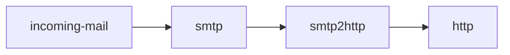

# smtp2http

A simple program which opens a smtp server and sends the incomings mails to your configured REST endpoint as POST request.



## Getting Started

```sh
git clone https://github.com/patlux/smtp2http.git
cd smtp2http
cargo run --release

# Starts the smtp server on port 25
# Sends all incoming mails as POST to http://localhost:1337/mail
sudo ./target/release/smtp2http server 127.0.0.1:25 http://localhost:1337/mail

# You can send a test mail to test if it's working
./target/release/smtp2http send-test-mail smtp://127.0.0.1:25

# Your web server at http://localhost:1337/mail
# should received a incoming POST request
```

## POST Data

The following data is sent to your configured REST endpoint.

```json
{
  "subject": "<email-subject>",
  "html": "<email-html-body>",
  "text": "<email-plain-text-body>"
}
```
